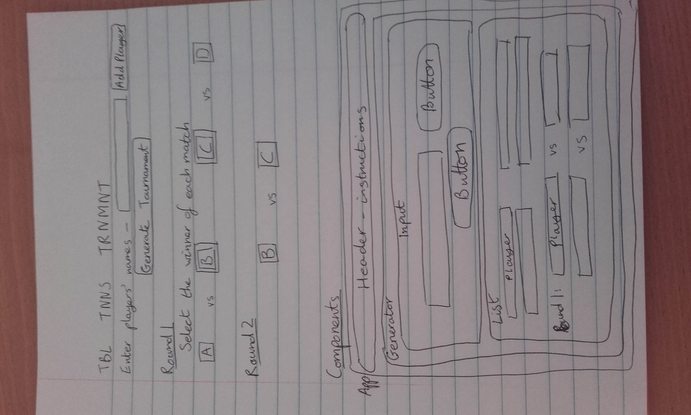
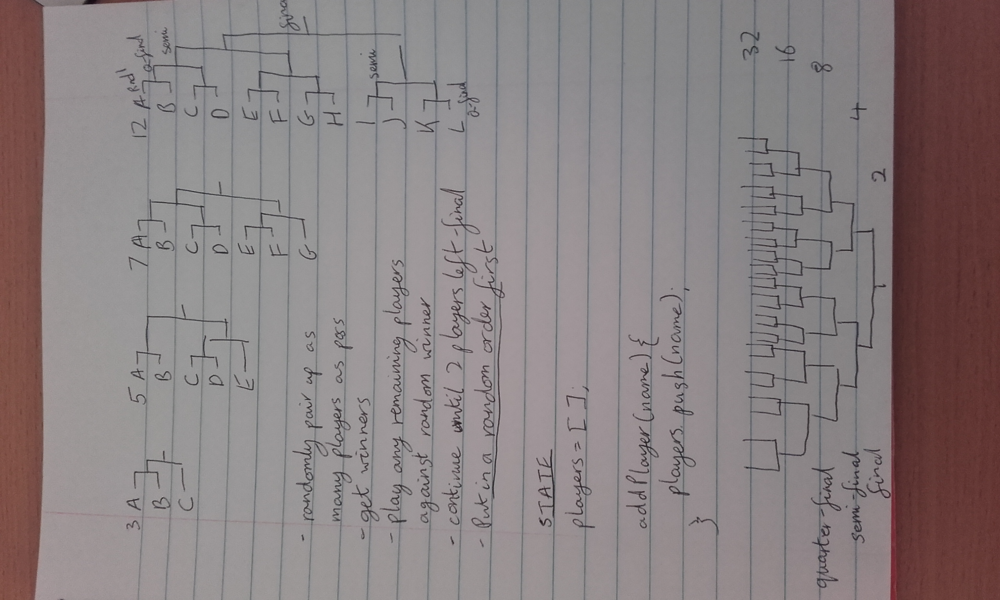

# Ping-Pong-App

This is my attempt at the technical challenge set by DevelopMe at the end of their Coding Fellowship. It is an app built with React/Redux, designed to generate random pairings for a Ping Pong Tournament.


## How to get the app working
Required: yarn, command line
1. Clone this repo: in the command line run ```git clone git@github.com:KateHoward10/Ping-Pong-App.git```
2. Navigate into ping-pong-app/
3. Run ```yarn``` to install node_modules
4. Run ```yarn start```


## The brief

"The exercise is to create a tool which randomly creates pairings for a table tennis tournament from a list of names collected from the user.

It's up to you how you implement this, with JavaScript, React, or PHP, as a web page, or as an app.

Optional advanced features might include:
ability to record scores for each player, or mark which player won from each pairing, to create the next round of the tournament playoffs
continued rounds until the final (last 2 players who have won all matches to date play each other)."


## Initial Planning

To begin with (in the absence of a reliable Internet connection), I did some wireframing and planning for the project (pictures below). I decided to make the app in ReactJS, which I did struggle with when we started learning it on the course (especially with Redux, and the structure of the whole system), but it was also one of the most recent topics covered and seemed to be quite suitable for this sort of project. Now I feel much more comfortable working with React so I'm glad I made this decision.

With ten full days in which to complete the challenge, my plan was to follow these steps in approximately this order of priority:
1. Wireframing, work out the basic structure.
2. Set up components and get the app to store/display players' names.
3. Work out the logic for randomising and pairing players.
4. Attempt to generate further rounds of the tournament.
5. Validation - check if the number of players is a power of 2?
6. Styling.
7. Write up.
8. Upload.





## Progress

Once the basic structure of the React app was ready, with players' names being inputted and displayed in a list, I focused on working out the logic. The state of the app originally contained just an array called "players", which the names were pushed into, randomised, and then reduced to an array of pairs who were to compete against each other. Then I added another array called "matches" to try and update each round, which morphed at one point into "newPlayers", an array which was intended to get half as large with each round, and alternate with "players" to store the current players.

This approach was doomed and I only got as far as generating two rounds, with the initial list of players getting lost as that array was updated. After taking a step back from the problem and speaking to other people on the course I realised my original idea - "matches" - was more sensible and would work best as an array of arrays getting half as large with each round. Then the Tournament component of the app could iterate over them and produce a list of pairings for each round. With the addition of a "winners" array as well the system became simple to update - players selected as the winners in each round were pushed into this array and used to generate the next array in "matches".


## Finished product

The app is now able to take in a list of players (as long as the number is a power of two) and generate as many rounds as it takes to reach a final and one single winner. Winners at each stage are selected by the user, and only one can be selected from each pairing. The app uses Bootstrap and follows a mobile-first design, with elements being styled differently at higher screen resolutions.


## Future considerations

This challenge was a great way to test our time management as well as technical skills, and while I think I did quite well to get it working and looking presentable, I would definitely make a few improvements if I had more time to work on my app.

- At the moment it only has one stylesheet, without a lot of styling other than Bootstrap, so it would be nice to do a bit more of this and implement Sass as well.
- The app has some screen-size responsiveness: at smaller widths it has a simple blue background so everything is easier to read, but at larger screen sizes the header is backed with a picture of the DevelopMe ping pong table to make the app look more interesting. I'm not entirely happy with how it resizes at some reolutions but I could spend hours trying to get this right.
- While it is not possible to select two winners from one match, I never quite worked out how to ensure that the right number of winners overall was being selected before generating the next round.
- I spent a lot of time working out some logic to randomly assign each player a new index and remove that index from the list in order to put all players in different places, and eventually found a naive method of shuffling that simply sorts by a random number. This made the code much simpler and seems to be fine, but I would be interested to look into other shuffling methods such as the Fisher-Yates algorithm, to see if that works better.
- It might be good for the user to have an Edit option as well as Delete for each player.
- I didn't make the most of GitHub during this project, only pushing to the repo when I remembered or made a major breakthrough. I am more confident with Git now though and would be more likely to take advantage of it in my next project.
- To begin with I thought about how to generate a tournament for a number of players that is not a power of two, but I still have very little idea how this could be done in the code. As real-life sporting tournaments tend to use powers of two I focused on getting this working instead, but it would be an interesting challenge to spend more time on.
